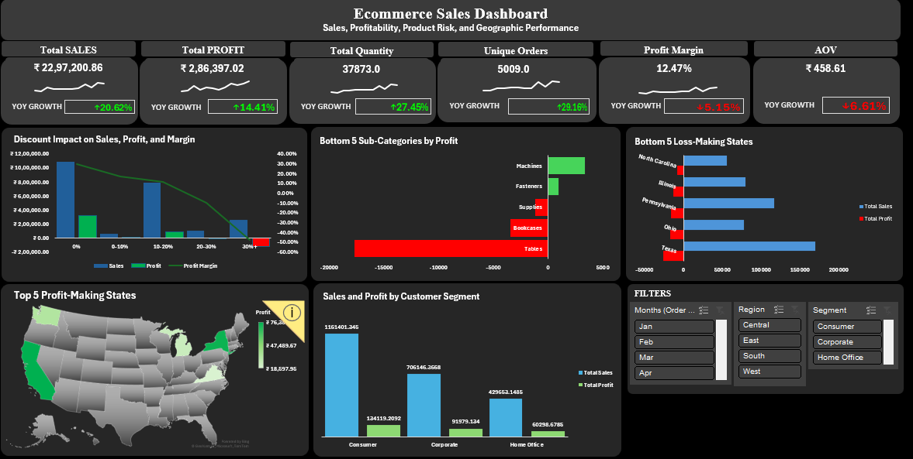
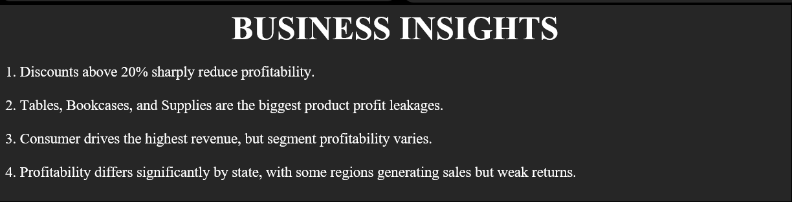

# Ecommerce Sales Analysis Dashboard

An interactive Excel dashboard project built to analyze ecommerce sales performance, profitability, discount risk, customer segments, shipping behavior, and regional performance across the United States.

---

## Dashboard Preview

Additional dashboard views:

---

## Project Objective

The goal of this project is to transform raw ecommerce transaction data into a business-focused Excel dashboard that helps answer questions such as:

- Which discount levels are reducing profitability?
- Which sub-categories are causing the biggest profit leakages?
- Which states generate weak returns despite revenue?
- Which customer segment contributes the highest sales and profit?
- How do key KPIs change across year, region, and segment filters?

---

## Dataset Overview

- Total records: `9,994`
- Time period: `2011` to `2014`
- Geography: `United States`
- Core fields used:
  - Order ID
  - Order Date
  - Ship Date
  - Customer ID / Customer Name
  - Segment
  - Region / State / City
  - Category / Sub-Category / Product Name
  - Sales
  - Quantity
  - Discount
  - Profit

---

## Final Dashboard Features

The current dashboard includes:

- KPI cards for:
  - Total Sales
  - Total Profit
  - Unique Orders
  - Total Quantity
  - Profit Margin
  - Average Order Value (AOV)
- Year-over-Year KPI indicators
- Discount impact analysis
- Bottom 5 sub-categories by profit
- Bottom 5 loss-making states
- Top 5 Profit-Making States
- Sales and profit by customer segment
- Business insight summary section
- Interactive slicers for:
  - Month
  - Region
  - Segment

---

## Key Insights

1. Discounts above `20%` begin to sharply reduce profitability, while `30%+` discounts create severe losses.
2. `Tables`, `Bookcases`, and `Supplies` are the biggest sub-category profit leakages.
3. `Consumer` drives the highest revenue, while profitability still varies across segments.
4. Profitability is uneven across states, with some geographies generating sales but weak returns.
5. Geographic and segment-level filtering helps identify which parts of the business are driving healthy growth.

---

## Business Recommendations

- Limit aggressive discounting above `20%` where margins are already weak.
- Review pricing, discounts, and cost structure for `Tables`, `Bookcases`, and other weak-margin sub-categories.
- Improve margin quality in low-performing states instead of pursuing revenue alone.
- Focus expansion and marketing on high-performing customer segments and profitable regions.
- Use filters to compare performance across different business slices before making pricing or product decisions.

---

## Workbook Structure

| Sheet Name | Purpose |
| --- | --- |
| `Home` | Navigation / landing sheet |
| `Data` | Main transaction dataset with calculated helper fields |
| `Pivot_KPI` | KPI backend pivot |
| `Monthly_KPI_Trend` | Monthly KPI trend support sheet |
| `Pivot_Discount` | Discount impact analysis |
| `Pivot_SubcategoryLoss` | Bottom sub-category profit leakage analysis |
| `Pivot_StatesLoss` | Bottom loss-making states analysis |
| `Pivot_StateProfitMap` | Geographic profitability view |
| `Pivot_Customer_Segment` | Customer segment sales and profit analysis |
| `DashBoard` | Final interactive dashboard |

---

## KPIs Tracked

- Total Sales
- Total Profit
- Unique Orders
- Total Quantity
- Profit Margin
- Average Order Value (AOV)
- Year-over-Year Sales Growth
- Year-over-Year Profit Growth
- Year-over-Year Orders Growth

---

## Excel Skills Demonstrated

- Data preparation and helper column creation
- PivotTables and PivotCharts
- KPI calculation and dashboard card design
- Discount and profitability analysis
- Geographic performance analysis
- Customer segment analysis
- Slicer-driven dashboard interactivity
- Business storytelling through dashboard design

---

## Tools Used

- Microsoft Excel
- Pivot Tables
- Pivot Charts
- Slicers
- Map Chart
- Excel formulas

---

## How To Use

1. Open `Ecommerce Sales Analysis.xlsx` in Microsoft Excel Desktop.
2. Go to the `DashBoard` sheet.
3. Use slicers to filter the dashboard by:
   - Month
   - Region
   - Segment
4. Review the KPI cards, visual insights, and business recommendations.

Best viewed in Microsoft Excel Desktop for full support of slicers, maps, and dashboard visuals.

---

## Repository Files

- `Ecommerce Sales Analysis.xlsx` - main project workbook
- `README.md` - project documentation
- `image.png`, `image-1.png` - dashboard preview images

---

## Why This Project Matters

This project demonstrates the ability to:

- turn raw sales data into executive-ready KPIs
- analyze profit leakage instead of focusing only on revenue
- design an interactive Excel dashboard with meaningful filters
- communicate business insights clearly for decision-making

It is built as a portfolio-ready student data analytics project with a strong focus on practical business analysis.

---

## Author

**Shivam Kumar**

Aspiring Data Analyst interested in:

- Excel
- SQL
- Power BI
- Business Analytics

---

## Notes

- Dashboard behavior may vary slightly across Excel versions.
- Best experience is in Microsoft Excel Desktop.
- Some charts depend on slicer-connected PivotTables and are intended for interactive use.
